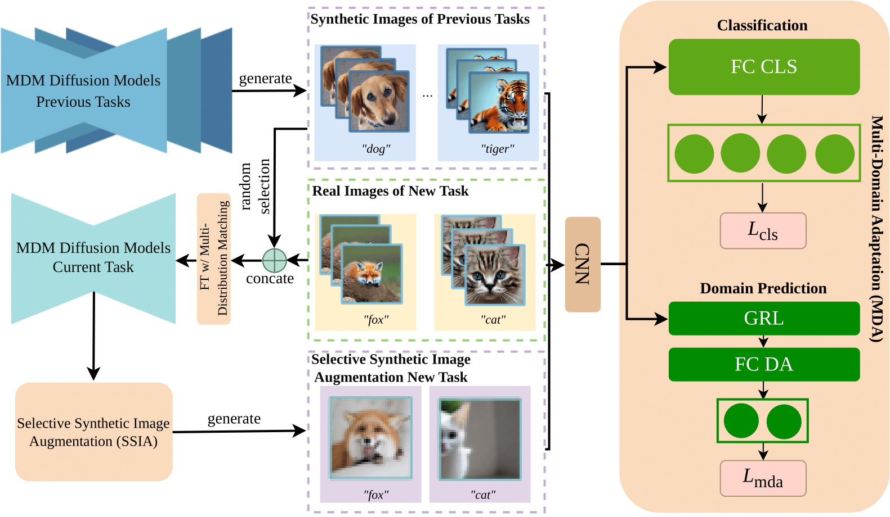

# DiffClass: Diffusion-Based Class Incremental Learning (ECCV 2024)


<p align="center">
  <a href='https://arxiv.org/abs/2403.05016'>
    
  </a>
  <a href='https://arxiv.org/abs/2403.05016.pdf'>
    
  </a>
  <a href='https://cr8br0ze.github.io/DiffClass/'>
  </a>
  <a href='https://github.com/cr8br0ze/DiffClass-Code'>
    </a>
  <a href="" target='_blank'>
    
  </a>
</p>


<p align="center">
<strong>DiffClass: Diffusion-Based Class Incremental Learning</strong></h1>
   <p align="center">
    <a href='https://cr8br0ze.github.io' target='_blank'>Zichong Meng</a>&emsp;
    <a href='https://zj-jayzhang.github.io' target='_blank'>Jie Zhang</a>&emsp;
    <a href='https://scholar.google.com/citations?user=aZvLu6wAAAAJ' target='_blank'>Changdi Yang</a>&emsp;
    <a href='https://zhanzheng8585.github.io' target='_blank'>Zheng Zhan</a>&emsp;
    <a href='https://puzhao.info/' target='_blank'>Pu Zhao</a>&emsp;
    <a href='https://web.northeastern.edu/yanzhiwang/' target='_blank'>Yanzhi Wang</a>&emsp;
    <br>
    Northeastern University &emsp; ETH Zürich &emsp;
    <br>
    ECCV 2024
  </p>
</p>


## 📜 TODO List
- [ ] Release the main codes for implementation.
- [ ] Release the evaluation codes and the pretrained models.

## 🤝 Citation
If you find this repository useful for your work, please consider citing it as follows:
```bibtex
@article{meng2024diffclass,
  title={Diffclass: Diffusion-based class incremental learning},
  author={Meng, Zichong and Zhang, Jie and Yang, Changdi and Zhan, Zheng and Zhao, Pu and WAng, Yanzhi},
  journal={arXiv preprint arXiv:2403.05016},
  year={2024}
}
```
